<div align="center">

# 🌾 KheetSathi (खेती साथी)
### **Edge AI-Powered On-Device Foliar Crop Disease Diagnostic & Ecosystem Platform**

[](https://github.com/Shubham-dev-stack/KheetSathi)
[](https://github.com/Shubham-dev-stack/KheetSathi)
[](https://onnxruntime.ai/)
[](https://github.com/Shubham-dev-stack/KheetSathi)
[](LICENSE)

> *"खेती का सच्चा साथी — बिना इंटरनेट खेत में सटीक फसल रोग पहचान और संपूर्ण समाधान"*  
> **"The True Companion of Farming — Instant, Zero-Data Foliar Diagnosis & Agricultural Support for Smallholder Farmers"**

---

[Key Highlights](#-key-highlights) • [System Architecture](#-system-architecture) • [Workflow & User Journey](#-workflow--user-journey) • [ML Inference Pipeline](#-edge-ai--ml-pipeline) • [Post-Diagnosis Ecosystem](#-post-diagnosis-ecosystem) • [Getting Started](#-getting-started) • [Contributors](#-lead-contributor--developer)

</div>

---

## 📌 Problem Statement & Context

In rural Indian farmlands, smallholder farmers lose **20% to 40% of their harvest annually** to preventable foliar diseases, pests, and nutrient deficiencies. Conventional AI solutions fail in the field because:
1. **Zero Internet in Farmlands:** Cloud-dependent AI apps fail due to spotty or non-existent 4G/5G mobile connectivity.
2. **High Latency & Server Costs:** Cloud processing drains bandwidth and requires expensive backend GPU server clusters.
3. **The Lab-to-Field Domain Shift:** Models trained on clean laboratory leaves fail on real-field photos containing background soil, hands, weeds, and shadows.
4. **False Confidence & Chemical Hazards:** Blind predictions on non-crop images lead to pesticide misuse and environmental toxicity.

### 💡 The KheetSathi Solution
**KheetSathi** is an **on-device Edge AI Progressive Web App (PWA)** that runs fine-tuned **MobileNetV2 neural networks directly inside the browser using WebAssembly (WASM SIMD)**. With an average inference time of **~16ms**, it requires **zero active internet connection, zero server round-trips, and zero recurring server costs**.

---

## ✨ Key Highlights

| Feature | Description | Technical Implementation |
|---|---|---|
| 🧠 **WASM Edge AI Engine** | Instant plant pathology inference directly on the farmer's mobile CPU | `ONNX Runtime Web (WASM SIMD)` • 15.95ms avg inference |
| 🔍 **Interactive Leaf ROI Bounding Box** | Crop lesion from field clutter, boosting resolution $4\times$ to $10\times$ | HTML5 Canvas coordinate transform & live crop slice |
| 🛡️ **3-Stage Reliability Gate** | Pre-inference luminance/blur checks & post-inference Shannon Entropy | Grayscale luminance, Laplacian $\sigma^2 \ge 65$, Shannon Entropy $H(P) < 2.0$ |
| 🌿 **3-Tier Actionable Remedies** | Cultural sanitation $\rightarrow$ Biological control $\rightarrow$ Responsible chemicals | Integrated ICAR & CIBRC agricultural standard guidelines |
| 🏷️ **Multi-Retailer Price Comparison** | Standardized ₹/100g & ₹/100ml pricing across local agri-retailers | Normalized pricing engine with Bio/Organic vs. Chemical filter |
| 👥 **Kisan Chaupal (Community Q&A)** | Local peer-to-peer farmer forum with verified expert answers | Topic-wise threaded discussion with upvotes & instant replies |
| 👨‍🔬 **Verified Agri Experts Directory** | Direct contact with plant pathologists and KVK extension agronomists | Color-coded consultation rate tags & instant call integration |
| 📈 **Longitudinal Health Timeline** | Multi-scan progress tracker (*Improving / Stable / Needs Attention*) | Chronological foliar observation logging & delta comparator |
| 🗣️ **Vernacular Voice Guidance** | Hands-free audio readout for low-literacy rural farmers | Web Speech API synthesis (`hi-IN` Hindi & `en-US` English) |
| 🌐 **100% Offline PWA Shell** | Operates entirely disconnected from cell towers | Cache-First ServiceWorker (`sw.js`) & LocalStorage persistence |

---

## 🏗️ System Architecture

KheetSathi is built with a strictly decoupled, 4-tier client-side architecture ensuring zero cloud dependency and low runtime memory footprint ($< 120\text{ KB}$ core bundle).

```mermaid
graph TD
    subgraph Presentation_Layer [📱 Client Presentation & UX Layer]
        A1[Farmer-First Responsive UI / PWA Shell]
        A2[Bilingual i18n Engine: Hindi / English]
        A3[Vernacular Audio Guidance - Web Speech API]
        A4[Interactive Leaf ROI Viewfinder Canvas]
    end

    subgraph Quality_Gate [🛡️ 3-Stage Reliability & Quality Gate]
        B1[Photometric Luminance Analyzer: Y in 35..230]
        B2[Laplacian Variance Blur Detector: Var >= 65]
        B3[Softmax Shannon Entropy Rejector: H < 2.0]
        B4[Cross-Crop Biological Pathogen Consistency]
    end

    subgraph Edge_AI [🧠 On-Device Edge AI Engine]
        C1[ONNX Runtime Web - WebAssembly SIMD]
        C2[MobileNetV2 FP32 / INT8 Quantized Model]
        C3[Tensor Preprocessing: 224x224 RGB Normalization]
        C4[Top-K Softmax Classifier: 38 Canonical Classes]
    end

    subgraph Ecosystem_Layer [🌾 Post-Diagnosis Agri Ecosystem]
        D1[Treatments Encyclopedia: Cultural / Bio / Chem]
        D2[Multi-Retailer Price Comparison: Rs/100g Basis]
        D3[Kisan Chaupal: Peer Q&A & Expert Solutions]
        D4[Verified Agri Experts Directory & Booking]
        D5[Farm Work Connect: Labor Marketplace]
        D6[Crop Health Timeline & Comparative Delta]
    end

    subgraph Storage_Layer [💾 Offline Cache & Storage Engine]
        E1[Service Worker Cache-First Storage - sw.js]
        E2[LocalStorage Diagnostics & User Records]
    end

    Presentation_Layer --> Quality_Gate
    Quality_Gate --> Edge_AI
    Edge_AI --> Ecosystem_Layer
    Ecosystem_Layer --> Storage_Layer
    Storage_Layer -.->|Offline Assets & State| Presentation_Layer
```



---

## 🔄 Workflow & User Journey

The end-to-end diagnostic and post-diagnosis ecosystem follows a seamless, farmer-centric lifecycle:


---

## 🧠 Edge AI & ML Pipeline

### 1. Neural Architecture
- **Base Architecture:** MobileNetV2 with inverted residual bottlenecks and linear expansion modules.
- **Quantization:** FP32 ONNX runtime export with INT8 Post-Training Quantization for ultra-low memory footprints on budget smartphones.
- **Input Dimensions:** `[1, 3, 224, 224]` float32 tensor normalized via standard ImageNet statistics ($\mu = [0.485, 0.456, 0.406]$, $\sigma = [0.229, 0.224, 0.225]$).
- **Execution Target:** ONNX Runtime WebAssembly SIMD (`ort.min.js`), fully executed on the client-side CPU/GPU thread.

### 2. Multi-Stage Reliability Gate

$$\text{Shannon Entropy: } H(P) = -\sum_{i=1}^{N} p_i \ln(p_i)$$

$$\text{Laplacian Blur Variance: } \sigma^2 = \frac{1}{M}\sum (L(x,y) - \bar{L})^2 \quad (\text{Threshold: } \sigma^2 \ge 65)$$

1. **Gate 1 (HTML5 Photometric & Laplacian Quality Gate):** Rejects underexposed ($Y < 35$), overexposed ($Y > 230$), or motion-blurred ($\sigma^2 < 65$) images before passing them to neural execution.
2. **Gate 2 (Shannon Softmax Entropy Rejection):** Evaluates dispersion across the 38 class logits. If $H(P) \ge 2.0$ or top probability $< 0.50$, the system classifies the sample as Out-Of-Distribution (OOD) or non-leaf and redirects safely without guessing.
3. **Gate 3 (Biological Consistency Check):** Cross-references predicted pathogen epidemiology against the farmer's declared crop species to prevent cross-botanical hallucinations (e.g., Apple Scab on Tomato).

### 3. Model Benchmark Provenance
- **PlantVillage In-Domain Dataset:** 54,305 verified pathology images across 38 canonical classes — **95.44% Top-1 / 99.68% Top-5 accuracy**.
- **PlantDoc In-Field Benchmark:** 2,569 real field images.
- **Leakage & Duplicate Audit:** 277 duplicate cross-split images identified and pruned via cryptographic perceptual hashing (`pHash`).

---

## 🌾 Post-Diagnosis Ecosystem

KheetSathi extends beyond raw disease detection into a complete post-diagnosis support system:

### 1. 📖 Disease & Treatments Encyclopedia
- Searchable compendium of crop diseases across major Indian staple crops (Potato, Tomato, Rice, Wheat, Cotton, Corn, Grape, Apple).
- 3-tier actionable remedies prioritizing zero-cost cultural measures, biological bio-fungicides (*Trichoderma viride*, Neem Seed Kernel Extract), and approved chemical controls with ICAR/CIBRC compliance disclaimers.

### 2. 🏷️ Multi-Retailer Product Price Comparison
- Standardized unit pricing (**₹/100g** or **₹/100ml**) across regional agricultural input retailers.
- Transparent Bio/Organic vs. Chemical categorization with one-tap store contact links.

### 3. 👥 Kisan Chaupal (Community Q&A Forum)
- Crop-filtered discussion threads allowing farmers to ask peer questions and receive verified expert answers.
- Community voting system (*"👍 मददगार लगा / Helpful"*) to elevate proven regional farming techniques.

### 4. 👨‍🔬 Verified Agri Experts Directory
- Certified directory of Agronomists, Entomologists, and KVK Extension Specialists.
- Clear consultation fee tags (Call, Video, Field Visit) and prototype booking interfaces with demo compliance disclaimers.

### 5. 🚜 Farm Work & Waste Management Advisor
- Connects local farmers needing seasonal agricultural labor (Harvesting, Spraying, Weeding) with available farm workers.
- Stubble and crop residue management advisor offering sustainable bio-decomposition and economic valorization guidance.

---

## 📂 Repository Structure

```
KheetSathi/
├── assets/
│   ├── images/               # High-res crop photography, hero banners, visual tutorials
│   └── icons/                # PWA icons & manifest assets
├── css/
│   └── styles.css            # Master Design System (Agritech CSS3 variables, mobile frame)
├── docs/                     # Full SIH 2026 engineering & architectural documentation
│   ├── 01_PROJECT_OVERVIEW.md
│   ├── 04_SYSTEM_ARCHITECTURE.md
│   ├── 05_AI_ML_ARCHITECTURE.md
│   ├── 12_SIH_PPT_BLUEPRINT.md
│   └── FINAL_HACKATHON_TECHNICAL_REVIEW.md
├── js/
│   ├── app.js                # Master application controller & navigation router
│   ├── data.js               # Mock data fixtures (Diseases, remedies, retailers, experts)
│   ├── i18n.js               # Bilingual translation dictionary (Hindi & English)
│   ├── mlEngine.js           # ONNX Runtime WebAssembly ML inference pipeline
│   ├── qualityCheck.js       # Photometric luminance & Laplacian blur quality checks
│   └── storage.js            # LocalStorage data persistence layer
├── model/
│   ├── class_labels.json     # 38 canonical class labels & mapping indices
│   ├── config.json           # Model preprocessing hyperparameters & thresholds
│   ├── model.onnx            # MobileNetV2 FP32 ONNX neural model
│   └── model_quantized.onnx  # INT8 quantized on-device ONNX model
├── index.html                # Master single-page application shell
├── manifest.json             # PWA Web App Manifest
├── sw.js                     # Cache-First ServiceWorker for 100% offline support
└── README.md                 # Master project documentation
```

---

## 💻 Tech Stack

- **Edge AI & Computer Vision:** ONNX Runtime Web (WASM SIMD), MobileNetV2, PyTorch, OpenCV (Preprocessing)
- **Quality & Image Heuristics:** HTML5 Canvas API, Grayscale Photometrics, 2D Laplacian Matrix Convolution
- **Frontend Architecture:** Vanilla ES6+ JavaScript, Modern CSS3 Custom Properties, Semantic HTML5
- **Offline & Storage:** PWA Service Worker (Cache Storage API v3.1), Web App Manifest, LocalStorage
- **Accessibility & Speech:** Web Speech API (`SpeechSynthesisUtterance`), Web Share API
- **Testing & Verification:** Chrome DevTools Protocol (CDP) Headless Testing Suite, Node.js QA Harness

---

## 🚀 Getting Started

### Prerequisites
- Any modern web browser with WebAssembly SIMD support (Chrome, Edge, Firefox, Safari, Brave).
- Python 3.x (or any local HTTP static server).

### 1. Clone the Repository
```bash
git clone https://github.com/Shubham-dev-stack/KheetSathi.git
cd KheetSathi
```

### 2. Start a Local Server
Because KheetSathi registers a Service Worker and loads WebAssembly (`.onnx` / `.wasm`), it must be served over `http://` or `https://` (not `file://`).

**Using Python:**
```bash
python -m http.server 8080
```

**Using Node.js (`npx`):**
```bash
npx serve -p 8080 .
```

**Using VS Code:**
- Install the **Live Server** extension.
- Right-click `index.html` $\rightarrow$ **Open with Live Server**.

### 3. Open in Browser
Navigate to `http://localhost:8080` on your desktop or mobile device.

---

## 🧪 Running Automated QA & Validation Suite

The repository includes automated validation scripts testing model consistency, bilingual i18n key parity, and full CDP browser journeys:

```bash
# 1. Syntax check all JS modules
node -c js/app.js js/data.js js/storage.js js/i18n.js js/mlEngine.js js/qualityCheck.js

# 2. Run i18n parity and data structure audit
node scratch/qa_test.js

# 3. Run full headless browser CDP test (24 scenarios + screenshots)
node scratch/run_visual_test.js
```

---

## 🗺️ Roadmap & Future Vision

- [x] **Phase 1:** Core MobileNetV2 WASM Edge AI inference & 38-class plant pathology integration.
- [x] **Phase 2:** 3-Stage Reliability Gate, HTML5 Canvas Quality Filter, and Leaf ROI Crop Box.
- [x] **Phase 3:** Crop Health Timeline, Longitudinal Comparative Delta Analyzer, and Vernacular Voice Guidance.
- [x] **Phase 4:** Post-Diagnosis Support Ecosystem (Multi-Retailer Price Comparison, Chaupal Q&A, Verified Experts Directory, Farm Work & Waste Advisor).
- [x] **Phase 5:** 12-Screen Farmer-First UI/UX Rebuild with Desktop Presentation Shell and Zero-Scrollbar Polish.
- [ ] **Future Scale 1:** Drone-based multispectral NDVI orthomosaic upload for acre-level heatmaps.
- [ ] **Future Scale 2:** Edge-quantized Small Language Model (SLM) for offline conversational advisory.
- [ ] **Future Scale 3:** Automated integration with PM Fasal Bima Yojana (PMFBY) claim validation APIs.

---

## 👨‍💻 Lead Contributor & Developer

<div align="center">

### **Shubham Kumar**
*Lead Architect, Full-Stack & Edge AI Developer*

[](https://github.com/Shubham-dev-stack)
[](mailto:shubhamcyberr@gmail.com)
[](https://github.com/Shubham-dev-stack/KheetSathi)

*Passionate about building high-impact, accessible Edge AI solutions and agrarian technologies for rural empowerment.*

</div>

---

## 📜 Compliance, Standards & Disclaimers

1. **Agronomic Recommendations:** All chemical and biological pesticide guidelines follow registered labels approved by the **Central Insecticides Board & Registration Committee (CIBRC)** and the **Indian Council of Agricultural Research (ICAR)**.
2. **Prototype Disclaimers:** Pricing information, expert directory entries, and farm labor postings are simulated prototype fixtures (`isDemo: true`) for SIH 2026 evaluation.
3. **Emergency Support:** For official government assistance, farmers can reach the 24x7 Kisan Call Center at **`1800-180-1551`**.

---

<div align="center">
  <sub>Built with ❤️ for Indian Farmers • Smart India Hackathon 2026 (SIH 2026)</sub>
</div>
