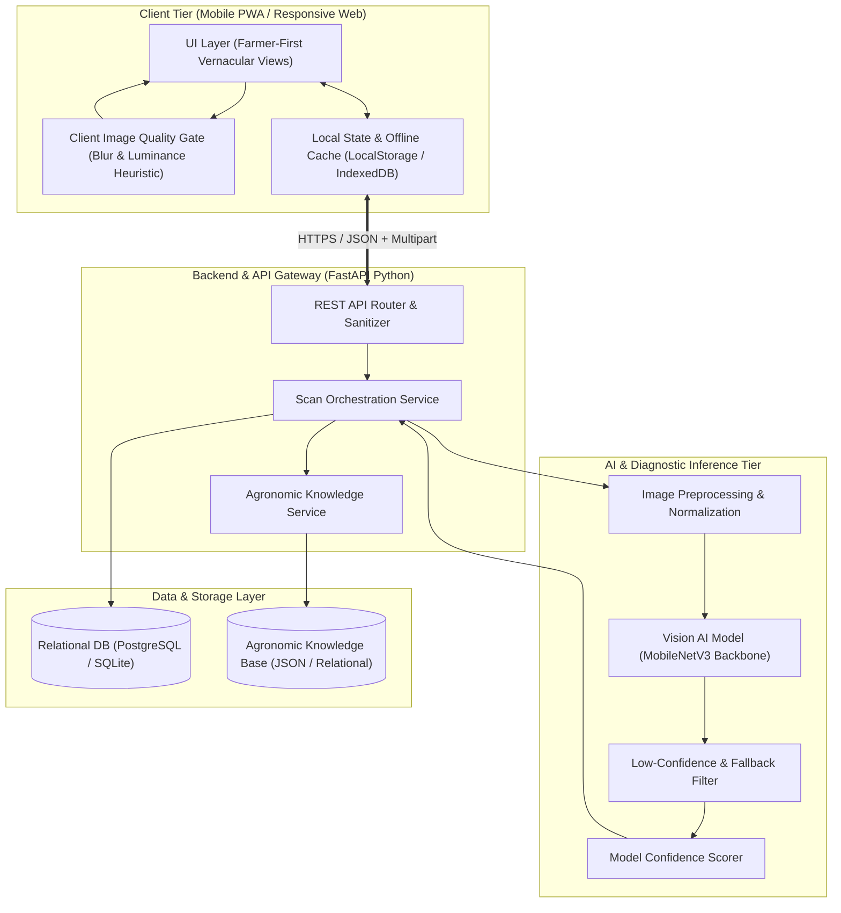
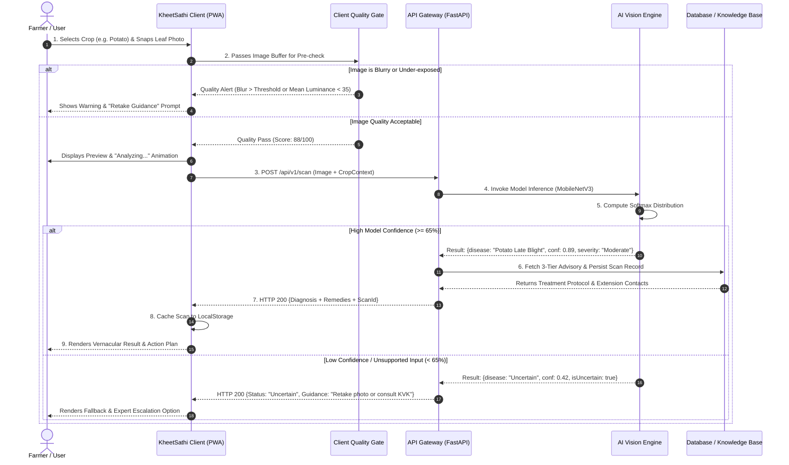
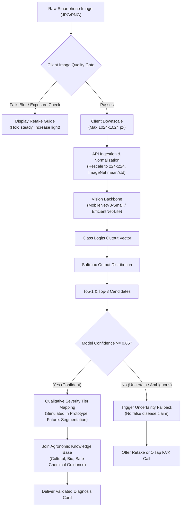

# Document 04: System Architecture Specification

**Project Name:** KheetSathi (खेती साथी)  
**Document Code:** ARCH-2026-V1.1  
**Architecture Paradigm:** Mobile-First Modular PWA / Cloud-Inference Ready / Edge-Transitional  
**Status:** Approved Technical Architecture (Post Technical Consistency Review)  

---

## 1. High-Level Logical Architecture

The KheetSathi platform is organized into clean, decoupled tiers ensuring resilience across intermittent network connectivity and clear separation of concerns between presentation, local validation, inference, and persistence.



---

## 2. Component Architecture Breakdown

```
+---------------------------------------------------------------------------------------+
|                                  COMPONENT TOPOLOGY                                   |
+---------------------------------------------------------------------------------------+
| 1. CLIENT APPLICATION (Mobile-First Web App / PWA)                                   |
|    - App Shell & Navigation Router                                                    |
|    - Localization Engine (i18n Hindi / English)                                       |
|    - Camera & File Ingestion Controller                                               |
|    - HTML5 Canvas Quality Assessment Engine (Laplacian Blur & Pixel Luminance Check)  |
|    - Diagnostic Visualization & Model Confidence Gauge                                |
|    - Local Scan History & Cache Store (LocalStorage / IndexedDB)                      |
+---------------------------------------------------------------------------------------+
| 2. BACKEND API GATEWAY (FastAPI Python - Planned Post-MVP)                            |
|    - Endpoint Routing (/api/v1/scan, /api/v1/crops, /api/v1/diseases)                 |
|    - Multipart Image Parser & Magic-Byte File Type Validator                          |
|    - Request Sanitization & Rate Limiting                                             |
|    - Scan History Persistence                                                         |
+---------------------------------------------------------------------------------------+
| 3. AI / COMPUTER VISION SERVICE (PyTorch / ONNX / TFLite Roadmap)                     |
|    - Tensor Input Formatter (Resizing to 224x224, Normalization)                      |
|    - MobileNetV3 Convolutional Backbone                                              |
|    - Low-Confidence Filter (<65% thresholding & non-leaf rejection)                  |
|    - Post-Processing: Simulated qualitative severity mapping                          |
+---------------------------------------------------------------------------------------+
| 4. AGRONOMIC KNOWLEDGE & ADVISORY REPOSITORY                                          |
|    - Structured Disease Catalog (Pathogen info, regional names, symptoms)            |
|    - 3-Tier Treatment Matrix (Cultural, Bio, Safe General Chemical)                   |
|    - Extension Helpline Registry (Kisan Call Center: 1800-180-1551, to be verified)   |
+---------------------------------------------------------------------------------------+
```

---

## 3. End-to-End Data & Request Flow



---

## 4. AI Inference Pipeline & Uncertainty Handling



---

## 5. Deployment Architecture Tradeoffs & Recommendation

| Dimension | Option A: Pure Cloud Inference | Option B: Pure On-Device Edge | Option C: Hybrid Edge-Cloud (Recommended) |
| :--- | :--- | :--- | :--- |
| **Description** | All images transmitted to cloud server running PyTorch/FastAPI. | Complete model packaged into mobile client via TFLite / ONNX. | Client handles quality gate & offline caching; Cloud runs model with pathway to download local model. |
| **Inference Latency** | $\approx 1.2\text{ s} - 2.5\text{ s}$ (dependent on cellular network). | $\approx 80\text{ ms} - 200\text{ ms}$ (zero network roundtrip). | Fast local validation ($\approx 50\text{ ms}$); Cloud diagnosis with offline fallback. |
| **Network Requirement** | Continuous internet connection required. | Zero internet required for diagnostic scan. | Works offline for cached history; syncs scans when connected. |
| **Hardware Requirement** | Minimal client processing power required. | Requires mid-tier smartphone CPU/NPU. | Accommodates entry-level Android smartphones. |
| **Hackathon Feasibility** | **High** (rapid deployment on modern web stacks). | Moderate (requires mobile binary compilation). | **Ideal Strategy** (Fast web prototype now $\rightarrow$ TFLite model packaging in roadmap). |
