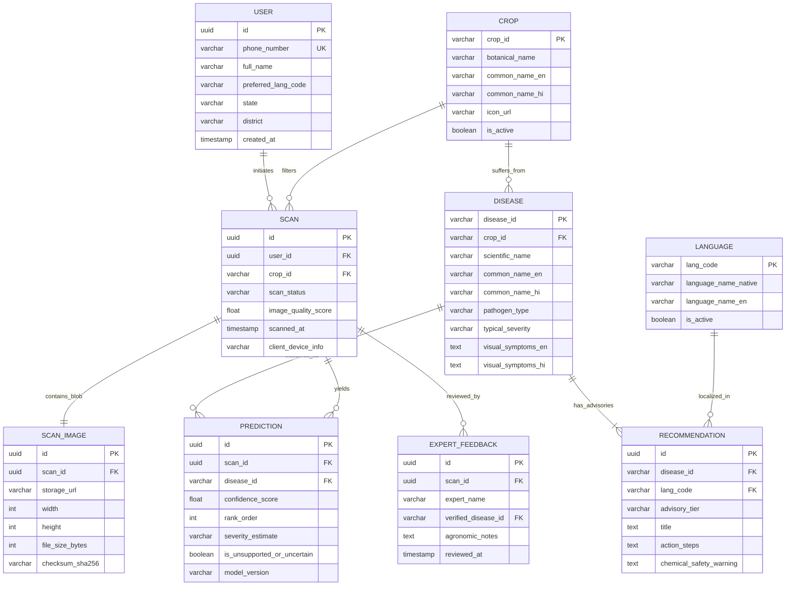

# Document 06: Relational Database & Entity Design

**Project Name:** KheetSathi (खेती साथी)  
**Document Code:** DBD-2026-V1.1  
**Database Engine:** PostgreSQL (Production) / SQLite (Backend Dev) / LocalStorage (Prototype)  
**Schema Paradigm:** Third Normal Form (3NF) Relational Data Model  
**Status:** Approved Schema Specification (Post Technical Consistency Review)  

---

## 1. Entity-Relationship Diagram (ERD)



---

## 2. Core Entities Specification

### 2.1 Entity Details & Schema Definitions

#### 1. `users` Table
* **Purpose:** Stores farmer profiles, contact numbers, regional location for localized KVK routing, and language preference.
* **Fields:**
  * `id` (UUID, PK): Unique user identifier.
  * `phone_number` (VARCHAR(15), Nullable for anonymous guest scans): Mobile login identifier.
  * `full_name` (VARCHAR(100)): Farmer name.
  * `preferred_lang_code` (VARCHAR(5), Default 'hi'): Selected UI language code.
  * `state` (VARCHAR(50)), `district` (VARCHAR(50)): Geolocation context.
  * `created_at` (TIMESTAMP WITH TIME ZONE): Account registration timestamp.

#### 2. `crops` Table
* **Purpose:** Master catalog of supported agricultural crops.
* **Fields:**
  * `crop_id` (VARCHAR(30), PK): Unique slug (e.g., `'potato'`, `'tomato'`, `'rice'`).
  * `botanical_name` (VARCHAR(100)): e.g., *Solanum tuberosum*.
  * `common_name_en` (VARCHAR(50)): e.g., *"Potato"*.
  * `common_name_hi` (VARCHAR(50)): e.g., *"आलू"*.
  * `icon_url` (VARCHAR(255)): SVG asset path.
  * `is_active` (BOOLEAN): Enabled status.

#### 3. `diseases` Table
* **Purpose:** Master catalog of plant diseases, symptoms, pathogen classes, and localized terminology.
* **Fields:**
  * `disease_id` (VARCHAR(50), PK): Unique disease slug (e.g., `'potato_late_blight'`).
  * `crop_id` (VARCHAR(30), FK $\rightarrow$ `crops.crop_id`).
  * `scientific_name` (VARCHAR(100)): Pathogen organism (e.g., *Phytophthora infestans*).
  * `common_name_en` (VARCHAR(100)): e.g., *"Late Blight"*.
  * `common_name_hi` (VARCHAR(100)): e.g., *"पछेती झुलसा"*.
  * `pathogen_type` (VARCHAR(30)): `'fungal'`, `'bacterial'`, `'viral'`, `'pest'`, `'healthy'`.
  * `typical_severity` (VARCHAR(20)): `'low'`, `'moderate'`, `'high'`.
  * `visual_symptoms_en` (TEXT), `visual_symptoms_hi` (TEXT): Plain language symptom descriptions.

#### 4. `scans` & `scan_images` Tables
* **Purpose:** Audit record of farmer image submissions, image metadata, quality assessment scores, and processing status.
* **Fields:**
  * `id` (UUID, PK): Scan identifier.
  * `user_id` (UUID, FK $\rightarrow$ `users.id`, Nullable).
  * `crop_id` (VARCHAR(30), FK $\rightarrow$ `crops.crop_id`).
  * `scan_status` (VARCHAR(20)): `'completed'`, `'uncertain'`, `'rejected_quality'`, `'failed'`.
  * `image_quality_score` (FLOAT): 0.0 to 100.0 quality assessment metric.
  * `scanned_at` (TIMESTAMP WITH TIME ZONE).

#### 5. `predictions` Table
* **Purpose:** Captures the model output candidate scores, uncertainty flags, and versioned AI model metadata for every scan.
* **Fields:**
  * `id` (UUID, PK).
  * `scan_id` (UUID, FK $\rightarrow$ `scans.id`).
  * `disease_id` (VARCHAR(50), FK $\rightarrow$ `diseases.disease_id`).
  * `confidence_score` (FLOAT): Model confidence score (0.00 to 1.00; simulated in prototype).
  * `rank_order` (INT): 1 for Top-1 candidate, 2 for Top-2, etc.
  * `severity_estimate` (VARCHAR(20)): Qualitative tier `'mild'`, `'moderate'`, `'severe'` (simulated in prototype).
  * `is_unsupported_or_uncertain` (BOOLEAN): Flag for low confidence or non-plant input.
  * `model_version` (VARCHAR(50)): e.g., `'mobilenetv3_sih_v1.0'`.

#### 6. `recommendations` Table
* **Purpose:** 3-Tier localized agronomic advisory protocols (Cultural, Bio/Organic, Regulated Chemical) linked to each disease.
* **Fields:**
  * `id` (UUID, PK).
  * `disease_id` (VARCHAR(50), FK $\rightarrow$ `diseases.disease_id`).
  * `lang_code` (VARCHAR(5), FK $\rightarrow$ `languages.lang_code`).
  * `advisory_tier` (VARCHAR(20)): `'cultural'`, `'biological'`, `'chemical'`.
  * `title` (VARCHAR(150)): Action header.
  * `action_steps` (TEXT): Step-by-step practical non-hazardous instructions.
  * `chemical_safety_warning` (TEXT): Compulsory regulatory and PPE warning.

---

## 3. Database Schema DDL (PostgreSQL / SQLite Compatible)

```sql
-- KheetSathi Core Schema Definition
CREATE TABLE languages (
    lang_code VARCHAR(5) PRIMARY KEY,
    language_name_native VARCHAR(50) NOT NULL,
    language_name_en VARCHAR(50) NOT NULL,
    is_active BOOLEAN DEFAULT TRUE
);

CREATE TABLE crops (
    crop_id VARCHAR(30) PRIMARY KEY,
    botanical_name VARCHAR(100),
    common_name_en VARCHAR(50) NOT NULL,
    common_name_hi VARCHAR(50) NOT NULL,
    icon_url VARCHAR(255),
    is_active BOOLEAN DEFAULT TRUE
);

CREATE TABLE diseases (
    disease_id VARCHAR(50) PRIMARY KEY,
    crop_id VARCHAR(30) NOT NULL REFERENCES crops(crop_id) ON DELETE CASCADE,
    scientific_name VARCHAR(100),
    common_name_en VARCHAR(100) NOT NULL,
    common_name_hi VARCHAR(100) NOT NULL,
    pathogen_type VARCHAR(30) NOT NULL,
    typical_severity VARCHAR(20) DEFAULT 'moderate',
    visual_symptoms_en TEXT NOT NULL,
    visual_symptoms_hi TEXT NOT NULL
);

CREATE TABLE scans (
    id VARCHAR(36) PRIMARY KEY,
    user_id VARCHAR(36),
    crop_id VARCHAR(30) REFERENCES crops(crop_id),
    scan_status VARCHAR(20) NOT NULL DEFAULT 'completed',
    image_quality_score REAL,
    scanned_at TIMESTAMP WITH TIME ZONE DEFAULT CURRENT_TIMESTAMP,
    client_device_info VARCHAR(100)
);

CREATE TABLE predictions (
    id VARCHAR(36) PRIMARY KEY,
    scan_id VARCHAR(36) NOT NULL REFERENCES scans(id) ON DELETE CASCADE,
    disease_id VARCHAR(50) NOT NULL REFERENCES diseases(disease_id),
    confidence_score REAL NOT NULL,
    rank_order INT DEFAULT 1,
    severity_estimate VARCHAR(20),
    is_unsupported_or_uncertain BOOLEAN DEFAULT FALSE,
    model_version VARCHAR(50) NOT NULL
);

CREATE TABLE recommendations (
    id VARCHAR(36) PRIMARY KEY,
    disease_id VARCHAR(50) NOT NULL REFERENCES diseases(disease_id) ON DELETE CASCADE,
    lang_code VARCHAR(5) NOT NULL REFERENCES languages(lang_code),
    advisory_tier VARCHAR(20) NOT NULL,
    title VARCHAR(150) NOT NULL,
    action_steps TEXT NOT NULL,
    chemical_safety_warning TEXT
);
```
