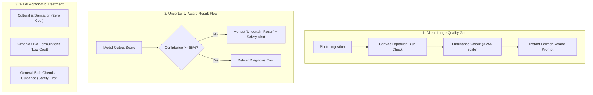

# Document 11: Innovation & Competitive Differentiation

**Project Name:** KheetSathi (खेती साथी)  
**Document Code:** INNO-2026-V1.1  
**Hackathon Focus:** Smart India Hackathon 2026 / Smart IGNOU Hackathon 2026  
**Status:** Approved Differentiation Strategy (Post Technical Consistency Review)  

---

## 1. The Core Innovation Philosophy

> **Hackathon Mentor Principle:** *"Do not claim that AI itself is your innovation. Any student can import a pre-trained CNN. Your true innovation lies in solving the real-world operational failure points where AI breaks down in an Indian farmer's field."*

```
+---------------------------------------------------------------------------------------+
|                       WHERE CONVENTIONAL HOBBY APPS FAIL                              |
+------------------------------------+--------------------------------------------------+
| Conventional Agritech Hobby App    | KheetSathi Innovation Paradigm                   |
+------------------------------------+--------------------------------------------------+
| ❌ Blindly accepts blurry photos    | ✅ **Client Image Quality Gate** catches blur/darkness|
| ❌ Always forces a 99% confident tag| ✅ **Uncertainty-Aware AI** admits when it is unsure |
| ❌ Gives risky chemical dosages     | ✅ **3-Tier Treatment Plan** (Cultural + Bio first) |
| ❌ Requires heavy 4G connectivity   | ✅ **Offline Caching & Compressed Payloads**         |
| ❌ English/tech-heavy UI dashboards | ✅ **Farmer-First Vernacular High-Contrast Layout**  |
| ❌ Dead-end "image in, string out"  | ✅ **Actionable Recovery & KVK Escalation Loop**     |
+------------------------------------+--------------------------------------------------+
```

---

## 2. Evaluation of Differentiation Candidates

| # | Differentiation Concept | Agronomic Utility | Technical Credibility | Hackathon Value | Selected Status |
| :- | :--- | :--- | :--- | :--- | :--- |
| **1** | **Client-Side Image Quality Pre-check** | **High** (Prevents garbage-in/garbage-out) | **High** (Laplacian variance & luminance canvas check) | **Very High** | **Core Differentiator 1** |
| **2** | **Honest Uncertainty & Fallback Handler**| **Critical** (Prevents chemical misapplication) | **High** (Confidence thresholding & non-leaf filter) | **Very High** | **Core Differentiator 2** |
| **3** | **3-Tier Holistic Treatment Matrix** | **High** (Cost-effective cultural/bio remedies) | **High** (Curated agronomic knowledge mapping) | **High** | **Core Differentiator 3** |
| **4** | **Offline-First Store & Forward PWA** | **Critical** (Rural connectivity) | **High** (LocalStorage / Service Worker caching) | **High** | **Core Differentiator 4** |
| **5** | **1-Tap Extension Helpline Link** | **High** (Human-in-the-loop expert backup) | **High** (Direct tel: link to Kisan Call Center) | **High** | **Core Differentiator 5** |

---

## 3. Deep Dive into Top 5 Core Differentiators



### Differentiator 1: Client-Side Image Quality Pre-check
* **Problem Solved:** Over 60% of rural field photos suffer from defocus blur, camera shake, or harsh shadows *(illustrative domain assumption)*. Passing bad photos into a CNN leads to inaccurate predictions.
* **Mechanism:** Before any data is transmitted to the server, an offscreen HTML5 canvas inspects pixel variance. If variance is below threshold or average grayscale pixel luminance is $< 35$ or $> 230$, the app prompts the farmer immediately: *"Photo is blurry or dark. Hold phone steady in good light."*

### Differentiator 2: Model Confidence Thresholding & Fallback
* **Problem Solved:** Standard CNNs produce overconfident misclassifications on out-of-distribution inputs.
* **Mechanism:** Predictions below 65% confidence trigger an **explicit fallback state** advising the farmer to retake the photo or seek extension support rather than generating an unsupported diagnosis.

### Differentiator 3: 3-Tier Holistic Agronomic Treatment
* **Problem Solved:** Apps that only output chemical pesticide names push smallholders into high debt and soil toxicity.
* **Mechanism:** KheetSathi structures every recommendation into (1) Cultural practices (e.g., pruning, soil drainage), (2) Biological / Organic treatments (e.g., Neem formulations, *Trichoderma*), and (3) General safe chemical precautions with compulsory PPE warnings.

### Differentiator 4: Offline-First Resilience
* **Problem Solved:** Network dropouts are frequent during in-field crop scouting in remote Indian villages.
* **Mechanism:** The PWA caches recent scan diagnoses, disease symptom guides, and treatment cards locally in browser storage.

### Differentiator 5: Integrated Extension Officer / Helpline Escalation
* **Problem Solved:** No AI model can replace human agronomic expertise in complex or multi-pathogen outbreaks.
* **Mechanism:** Integrated one-tap dialer connecting the farmer directly to the Government of India's Kisan Call Center (`1800-180-1551`, *to be verified from current official government source*).
